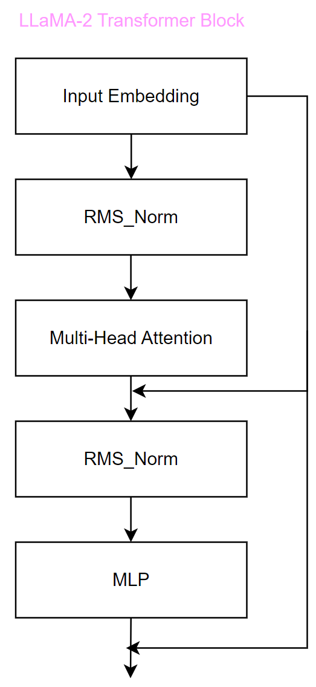

# MP-ACL: Midterm Project for the AI Class with Llama 2
## Project Team Members
* **Wenxiao Xue** (24212020213) -- [Github@xwwwwwx](https://github.com/xwwwwwx)

* **Xuanda Lin** (24212020013) -- [Github@GeorgeLin200100](https://github.com/GeorgeLin200100)

## Summary
* Model Architecture: LLaMa-2
* Dataset: TinyStories (text generation --> story telling)
* Total Parameter Size: 12,597,504
* Training & Inference Cost: around 2h
* Performance: coherency within sentence achieved, coherency within whole story failed 

## Getting Started
Clone the repository:

`git clone https://github.com/GeorgeLin200100/MP-ACL.git`

Run the `run.sh` in bash. 

```
chmod +x ./run.sh
./run.sh
```

### Dependencies
* Python 3.12.5
* PyTorch 2.5.0+cu124
* SentencePiece 0.2.0

## Model Architecture
**MP-ACL** constructs a model behaved like `LLaMA-2` from scratch. The LLaMA-2 model is a generative pretrained transformer model based on the original transformer architecture. Differences between LLaMA-2 and original transformer Models are overviewed as follows:

* Normalization Methods
    * LLaMA-2 models features *pre-normalization* with the *RMS_Norm* method, which means that normalization is applied prior to *attention* and *MLP* layers in a single transformer block. *RMS_Norm* is formulated as below. Please refer to `RMSNorm` class in `transformer.py`
  
    $$
    \overline{a_i}=\frac{a_i}{RMS},\ where\ RMS=\sqrt{\frac{1}{n}\sum^n_{i=1}a_i^2}
    $$

    * In contrast, original transformer Models features *layer normalization*, applied after *attention* and *MLP* layers in a single transformer block.

<div align=center></div>

* Activation Functions
    * LLaMA-2 models adopts the *SwiGLU* activation function within its feed-forward layers. *SwiGLU* is an element-wise product of two linear transformations of the input x, one of which has had a Swish activation applied to it. It has been found to yield improvements in performance relative to other activation functions. Please refer to `SwiGLU` class in `transformer.py`

    $$
    SwiGLU(x)=Swish(xW)\cdot xV\ \\(can\ also\ be\ Swish(xW)+ xV\ for\ simplicity)\\
    Swish(x)=x\cdot(Sigmoid(\beta x))
    $$

    * Original transformer models adopts the *Relu* activation function within its feed-forward layers.

* Positional Encoding
    * LLaMA-2 models adopts the *RoPE* scheme for positional encoding, which finds a balance between the absolute and relative position of each token in a sequence. This position embedding approach encodes absolute position with a rotation matrix and adds relative position information directly into the self-attention operation. It's most suitable for long sequence lengths.
    * Original transformer models adopts absolute or relative positional embeddings. 

## Dataset
This project utilizes the *TinyStories* dataset, avaliable on [Huggingface/roneneldan/TinyStories](https://huggingface.co/datasets/roneneldan/TinyStories). For quick training, we use the 19.4MB *TinyStries-valid.txt* instead of 1.92GB *TinyStories-train.txt* as our training material. 

*TinyStories* is a synthetic dataset of short stories that only contains words that a typical 3 to 4-years-old usually understand, generated by GPT-3.5 and GPT-4. Typical items are shown below.

```
Item 1: One day, a little girl named Lily found a needle in her room. She knew it was difficult to play with it because it was sharp. Lily wanted to share the needle with her mom, so she could sew a button on her shirt. Lily went to her mom and said, "Mom, I found this needle. Can you share it with me and sew my shirt?" Her mom smiled and said, "Yes, Lily, we can share the needle and fix your shirt." Together, they shared the needle and sewed the button on Lily's shirt. It was not difficult for them because they were sharing and helping each other. After they finished, Lily thanked her mom for sharing the needle and fixing her shirt. They both felt happy because they had shared and worked together.
Item 2: Once upon a time, there was a little car named Beep. Beep loved to go fast and play in the sun. Beep was a healthy car because he always had good fuel. Good fuel made Beep happy and strong. One day, Beep was driving in the park when he saw a big tree. The tree had many leaves that were falling. Beep liked how the leaves fall and wanted to play with them. Beep drove under the tree and watched the leaves fall on him. He laughed and beeped his horn. Beep played with the falling leaves all day. When it was time to go home, Beep knew he needed more fuel. He went to the fuel place and got more healthy fuel. Now, Beep was ready to go fast and play again the next day. And Beep lived happily ever after.
```

## Data Preprocessing
### Tokenizer
In this project, the `Tokenizer` class is designed to handle tokenization and detokenization of text using the Google `SentencePiece` unsupervised text tokenizer and detokenizer as our backbone.

To enhance tokenizer capability, we introduce a seperate function to train a new SentenPiece model from a text file (using *SentencePieceTrainer* as our backbone), which allows us to create a tokenizer tailored to our specific *TinyStories* dataset. See `train_tokenizer` function in `tokenizer.py`.

### Rearrange Dataset for Prediction
We rearrange the original dataset to suit for the task of next token generation. (See `NextTokenPredictionDataset` class in dataset.py) The class reads the input file (the original dataset) line by line, strips whitespace from each line and encodes it into tokens using the tokenizer. The encoded tokens are then collected in a list and converted into a PyTorch tensor. We could then use the *\_\_getitem\_\_* method to retrieves a sample from the dataset. It returns a tuple of two tensors. First consists of the tokens from *idx* to *idx+context_size*, serves as the input context. Second consists of the tokens from *idx+1* to *idx+context_size+1*, serves as the target context.

### DataLoader
We then shuffle and batch up the data using `DataLoader` from `torch.utils.data`.

## Training Strategy
In this project, we utilize the most common training strategy for most NNs. (See `trainer.py`)

With the model set to training mode and mapped to multiple GPUs with `DataParallel()`, we create an `Adam` optimizer and a `cosine annealing` learning rate scheduler for the training loop. Within the loop, we iterates over the number of epochs and through batches of data to process the inputs to produce logits (prediction). The loss is computed using cross-entropy, reshaping the logits and labels appropriately to match dimensions and backpropagated to compute gradients. The optimizer then updates the model's parameters based on the computed gradients. The learning rate scheduler is then updated at each step.

## Evaluation Strategy
For simplicity, we just feed a list of prompts to generate corresponding outputs. No cross-validation has been tested.

Example prompts are listed below:
```
prompts = [
    "Once upon a time, Tom is very hungry, but he doesn't",
    "I like apple, but Lily loves",
    "Once upon a time, there is a boy named Tom.",
    "Once upon a time, there is a girl named Lily. One day, she",
    "I love the monkey, but",
    "Once upon a time, there is a monkey",
    "Once upon a time, the sun is dimmed.",
    "Once upon a time, the water is dirty.",
    "Once upon a time, sophia won the first prize in the competition.",
    "Once upon a time, there was a little brown dog named Spot.",
    "Once upon a time, there was a little boy named Tom.",
    "Once upon a time, there was a big whale. ",
    "Once upon a time, there was a ",
    "Once upon a time, ",
    "Once",
    "Tim and Lily were playing in the park.",
    "Tom had a coin that he liked very much.",
    "Tim and Mia like to play in the backyard.",
    "Tom and Mia went to the zoo with Mom and Dad.",
    "Anna liked to speak to her toys.",
    "Lily was playing with her doll in the garden.",
    "Tim likes to talk about politics.",
    "Sophia never eats breakfast.",
    "Lucy tell a weird story.",
    "Lucy and Lily are playing computer games."
]
```

## Results
Due to the small dataset and tiny model parameter size, results for this project are funny. Sentence structures are basically **correct**, and coherency within a sentence could mostly be guaranteed. However, for story generation task, the result still not convincing, for coherency lack between sentences. Hope solved in the future ^_^

### Selected Results for training just 3000 steps (1 epoch)

* Result1: Once upon a time, sophia won the first prize in the competition. The clown was very proud of her. She was very happy and brought her friend and said they were so much sweet.
* Result2: Once upon a time, a little little boy named Timmy. Timmy was so happy that he couldn't get a little car. He was very proud. ...Timmy's mom gave him his toy car and he was very happy. He would always hear the engine.

* Result3: Once upon a time, Tom is very hungry, but he doesn't made her feel better. Their mommy saw the idea, but they were very upset and they had no idea. She enjoyed seeing the pictures and it was not bad. Everybody felt happy and safe. they were so much fun and had the best thing and felt very happy.

See `run_step_3000_epoch_1.log`

### Selected Results for training just 5000 steps (1 epoch)
* Result 1: Once upon a time, Tom is very hungry, but he doesn't always want to get his rest.

* Result 2: Once upon a time, there is a girl named Lily. One day, she was very persistent and decided to take the coins. So, she decided to look for the brokenness. She found the special spot, and curled up in her pocket. But then she realised that it was all of the friends to enjoy something, so that they should stay in the stable and rest. 

* Result 3: Once upon a time, there is a girl named Lily. One day, she was so excited to go around the store with her family.

See `run_step_5000_epoch_1.log`

### Selected Results for training the whole 9600 steps of the dataset (1 epoch)
* Result 1: Once upon a time, Tom is very hungry, but he doesn't know what to eat. He didn't know what to do. Tom's mom saw him looking for a special price. She asked Tom if he wanted to eat some of the rice, but he did not want to share. Tom was so sad, he started to cry, and he asked Tom if he wanted. Tom said no, but he didn't want to share his food with him. His mom told him not to spill the rice, too. Tom felt so bad that he would never get to eat. He was happy that his mom was not mad. 

* Result 2: Once upon a time, there was a little girl named Lucy. She had a pet cat named Tom. Tom was so excited and wanted to play with her. He asked her if she wanted to ride the cat and the cat, and Lily said yes. Tom was so excited and rang the cat with a big smile. He grabbed his shoes and ran off to play with his friends. Lily was so happy and sang to Tom and Lily. 

* Result 3: Once upon a time, there is a boy named lucius. He looked around and saw the sun rolling down in the air. He was scared and shouted at his sister.

* Result 4: Once upon a time, there is a girl named Lily. One day, she was very scared and started to scare.

See `result0.txt` and `run_step_all_epoch_1.log`

## Acknowledgement
This project is inspired by another Github repository [scratch-llm](https://github.com/clabrugere/scratch-llm) which using sharespeare dataset to train LLaMa-2. Thanks Clément for the step-by-step instruction!